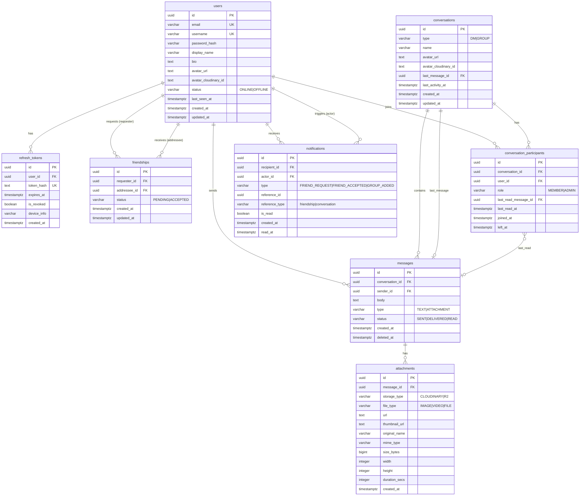

# 2. Database Design — Real-time Chat Application

> **Version:** 1.0.0
> **Database:** PostgreSQL 16 (Neon Serverless)
> **Dựa trên:** `1_MVP_Requirements.md` v1.1.0

---

## 1. Entity Relationship Diagram (ERD)



---

## 2. Chi Tiết Từng Table

### 2.1 `users`

Lưu trữ thông tin tài khoản và trạng thái presence.

```sql
CREATE TABLE users (
    id                      UUID            PRIMARY KEY DEFAULT gen_random_uuid(),
    email                   VARCHAR(255)    NOT NULL,
    username                VARCHAR(30)     NOT NULL,              -- @handle, chỉ a-z0-9_, unique
    password_hash           VARCHAR(255)    NOT NULL,              -- bcrypt, cost=12
    display_name            VARCHAR(50)     NOT NULL,
    bio                     VARCHAR(160),                          -- Giới hạn 160 ký tự như Twitter
    avatar_url              TEXT,                                  -- Cloudinary CDN URL (hiển thị)
    avatar_cloudinary_id    TEXT,                                  -- Cloudinary public_id (để xóa ảnh cũ)
    status          VARCHAR(10)     NOT NULL DEFAULT 'OFFLINE'
                        CHECK (status IN ('ONLINE', 'OFFLINE')),
    last_seen_at    TIMESTAMPTZ     NOT NULL DEFAULT NOW(),
    created_at      TIMESTAMPTZ     NOT NULL DEFAULT NOW(),
    updated_at      TIMESTAMPTZ     NOT NULL DEFAULT NOW()
);
```

| Column | Type | Ghi chú |
|--------|------|---------|
| `id` | `UUID` | PK, `gen_random_uuid()` |
| `email` | `VARCHAR(255)` | Unique, lowercase, index |
| `username` | `VARCHAR(30)` | Unique, chỉ cho phép `a-z`, `0-9`, `_` — dùng để tìm kiếm (`@handle`), không thể đổi tùy ý |
| `password_hash` | `VARCHAR(255)` | bcrypt cost=12, không lưu plain text |
| `display_name` | `VARCHAR(50)` | Tên hiển thị, có thể đổi tự do |
| `bio` | `VARCHAR(160)` | Nullable, mô tả bản thân, giới hạn 160 ký tự |
| `avatar_url` | `TEXT` | Nullable, Cloudinary CDN URL — dùng để hiển thị `` |
| `avatar_cloudinary_id` | `TEXT` | Nullable, Cloudinary `public_id` — dùng để gọi `DELETE /v1/resources` khi user đổi/xóa avatar. Nếu `NULL` thì user chưa upload avatar. |
| `status` | `VARCHAR(10)` | `ONLINE` \| `OFFLINE`, cập nhật qua WebSocket |
| `last_seen_at` | `TIMESTAMPTZ` | Dùng cho "Last seen HH:MM" |

```sql
-- Indexes
CREATE UNIQUE INDEX idx_users_email    ON users (LOWER(email));
CREATE UNIQUE INDEX idx_users_username ON users (LOWER(username));
CREATE INDEX        idx_users_display  ON users USING GIN (display_name gin_trgm_ops);
CREATE INDEX        idx_users_username_trgm ON users USING GIN (username gin_trgm_ops);
                                                -- Tìm kiếm @handle dạng partial match
```

> **`pg_trgm`:** Cần `CREATE EXTENSION IF NOT EXISTS pg_trgm;` — hỗ trợ `ILIKE '%keyword%'` nhanh.

---

### 2.2 `refresh_tokens`

Quản lý Refresh Token rotation. Mỗi lần refresh tạo token mới, token cũ bị revoke.

```sql
CREATE TABLE refresh_tokens (
    id          UUID            PRIMARY KEY DEFAULT gen_random_uuid(),
    user_id     UUID            NOT NULL REFERENCES users(id) ON DELETE CASCADE,
    token_hash  TEXT            NOT NULL,   -- SHA-256 của raw token, không lưu plain
    expires_at  TIMESTAMPTZ     NOT NULL,   -- NOW() + 7 days
    is_revoked  BOOLEAN         NOT NULL DEFAULT FALSE,
    device_info VARCHAR(255),               -- User-Agent hoặc device label (optional)
    created_at  TIMESTAMPTZ     NOT NULL DEFAULT NOW()
);
```

```sql
CREATE UNIQUE INDEX idx_refresh_tokens_hash     ON refresh_tokens (token_hash);
CREATE INDEX        idx_refresh_tokens_user     ON refresh_tokens (user_id);
CREATE INDEX        idx_refresh_tokens_expires  ON refresh_tokens (expires_at)
                        WHERE is_revoked = FALSE;  -- Partial index cho cleanup job
```

> **Cleanup:** Cron job hàng ngày `DELETE FROM refresh_tokens WHERE expires_at < NOW() OR is_revoked = TRUE`.

---

### 2.3 `friendships`

Quan hệ bạn bè 2 chiều theo mô hình Facebook.

```sql
CREATE TABLE friendships (
    id              UUID            PRIMARY KEY DEFAULT gen_random_uuid(),
    requester_id    UUID            NOT NULL REFERENCES users(id) ON DELETE CASCADE,
    addressee_id    UUID            NOT NULL REFERENCES users(id) ON DELETE CASCADE,
    status          VARCHAR(10)     NOT NULL DEFAULT 'PENDING'
                        CHECK (status IN ('PENDING', 'ACCEPTED')),
    created_at      TIMESTAMPTZ     NOT NULL DEFAULT NOW(),
    updated_at      TIMESTAMPTZ     NOT NULL DEFAULT NOW(),

    CONSTRAINT chk_no_self_friend   CHECK (requester_id <> addressee_id),
    CONSTRAINT uq_friendship_pair   UNIQUE (
        LEAST(requester_id::text, addressee_id::text)::uuid,
        GREATEST(requester_id::text, addressee_id::text)::uuid
    )
    -- Ngăn duplicate theo cả 2 chiều (A→B và B→A không thể cùng tồn tại)
);
```

> ⚠️ **Note về `uq_friendship_pair`:** PostgreSQL không hỗ trợ function-based unique constraint trực tiếp trên UUID. Thay thế thực tế: dùng 2 partial unique index + CHECK ở application layer:

```sql
-- Thay thế thực tế:
CREATE UNIQUE INDEX idx_friendships_canonical
    ON friendships (
        LEAST(requester_id::text, addressee_id::text),
        GREATEST(requester_id::text, addressee_id::text)
    );
```

```sql
-- Lookup nhanh theo từng user
CREATE INDEX idx_friendships_requester ON friendships (requester_id, status);
CREATE INDEX idx_friendships_addressee ON friendships (addressee_id, status);
```

**Query patterns:**

```sql
-- Kiểm tra 2 user có phải bạn bè không
SELECT id, status, requester_id
FROM friendships
WHERE (requester_id = $1 AND addressee_id = $2)
   OR (requester_id = $2 AND addressee_id = $1)
LIMIT 1;

-- Danh sách bạn bè của user $1
SELECT
    CASE WHEN requester_id = $1 THEN addressee_id ELSE requester_id END AS friend_id
FROM friendships
WHERE (requester_id = $1 OR addressee_id = $1)
  AND status = 'ACCEPTED';

-- Danh sách lời mời chờ xử lý (user $1 là người nhận)
SELECT * FROM friendships
WHERE addressee_id = $1 AND status = 'PENDING'
ORDER BY created_at DESC;
```

---

### 2.4 `conversations`

Đại diện cho cả DM (1-1) và Group Chat.

```sql
CREATE TABLE conversations (
    id                UUID            PRIMARY KEY DEFAULT gen_random_uuid(),
    type              VARCHAR(5)      NOT NULL CHECK (type IN ('DM', 'GROUP')),
    name              VARCHAR(100),               -- NULL cho DM, required cho GROUP
    avatar_url        TEXT,                       -- NULL cho DM, optional cho GROUP — Cloudinary CDN URL
    avatar_cloudinary_id TEXT,                   -- Cloudinary public_id để xóa ảnh cũ khi đổi avatar nhóm
    last_message_id   UUID,                       -- FK → messages (set sau)
    last_activity_at  TIMESTAMPTZ     NOT NULL DEFAULT NOW(),
    created_at        TIMESTAMPTZ     NOT NULL DEFAULT NOW(),
    updated_at        TIMESTAMPTZ     NOT NULL DEFAULT NOW(),

    CONSTRAINT chk_group_name CHECK (
        type = 'DM' OR (type = 'GROUP' AND name IS NOT NULL)
    )
);

-- FK sau khi messages table tồn tại
ALTER TABLE conversations
    ADD CONSTRAINT fk_conversations_last_message
    FOREIGN KEY (last_message_id) REFERENCES messages(id) ON DELETE SET NULL;
```

```sql
CREATE INDEX idx_conversations_activity ON conversations (last_activity_at DESC);
CREATE INDEX idx_conversations_type     ON conversations (type);
```

---

### 2.5 `conversation_participants`

Bảng trung gian quản lý thành viên + **trung tâm của cơ chế Read/Unread**.

```sql
CREATE TABLE conversation_participants (
    id                      UUID            PRIMARY KEY DEFAULT gen_random_uuid(),
    conversation_id         UUID            NOT NULL
                                REFERENCES conversations(id) ON DELETE CASCADE,
    user_id                 UUID            NOT NULL
                                REFERENCES users(id) ON DELETE CASCADE,
    role                    VARCHAR(10)     NOT NULL DEFAULT 'MEMBER'
                                CHECK (role IN ('MEMBER', 'ADMIN')),
    last_read_message_id    UUID
                                REFERENCES messages(id) ON DELETE SET NULL,
    last_read_at            TIMESTAMPTZ,
    joined_at               TIMESTAMPTZ     NOT NULL DEFAULT NOW(),
    left_at                 TIMESTAMPTZ,            -- NULL = đang là thành viên

    CONSTRAINT uq_participant UNIQUE (conversation_id, user_id)
);
```

```sql
CREATE INDEX idx_cp_conversation  ON conversation_participants (conversation_id)
                WHERE left_at IS NULL;              -- Chỉ active members
CREATE INDEX idx_cp_user          ON conversation_participants (user_id)
                WHERE left_at IS NULL;
CREATE INDEX idx_cp_last_read     ON conversation_participants (last_read_message_id);
```

---

### 2.6 `messages`

Lõi của ứng dụng. Thiết kế tối ưu cho cursor-based pagination.

```sql
CREATE TABLE messages (
    id              UUID            PRIMARY KEY DEFAULT gen_random_uuid(),
    conversation_id UUID            NOT NULL
                        REFERENCES conversations(id) ON DELETE CASCADE,
    sender_id       UUID            NOT NULL
                        REFERENCES users(id) ON DELETE RESTRICT,
                        -- RESTRICT: không xóa user nếu còn message
                        -- ⚠️ GDPR note: nếu sau này có tính năng "Xóa tài khoản",
                        -- KHÔNG dùng CASCADE (mất toàn bộ lịch sử chat).
                        -- Giải pháp ở Application Layer: trước khi DELETE user,
                        -- UPDATE messages SET sender_id = <system_deleted_user_uuid>
                        -- System account "[Deleted User]" được seed sẵn, UUID cố định,
                        -- không thể login, display_name = '[Deleted User]', avatar = NULL.
    body            TEXT,                       -- NULL nếu là pure attachment
    type            VARCHAR(12)     NOT NULL DEFAULT 'TEXT'
                        CHECK (type IN ('TEXT', 'ATTACHMENT')),
    status          VARCHAR(10)     NOT NULL DEFAULT 'SENT'
                        CHECK (status IN ('SENT', 'DELIVERED', 'READ')),
                        -- Chỉ dùng cho DM. Group: luôn là 'SENT'
    created_at      TIMESTAMPTZ     NOT NULL DEFAULT NOW(),
    updated_at      TIMESTAMPTZ,               -- NULL = chưa edit (future-proof cho message edit)
    deleted_at      TIMESTAMPTZ                -- Soft delete: NULL = chưa xóa

    CONSTRAINT chk_message_content CHECK (
        body IS NOT NULL OR type = 'ATTACHMENT'
    )
);
```

```sql
-- Index chính cho cursor-based pagination (load lịch sử chat)
CREATE INDEX idx_messages_conversation_cursor
    ON messages (conversation_id, created_at DESC, id DESC)
    WHERE deleted_at IS NULL;

-- Index cho unread count query
CREATE INDEX idx_messages_created ON messages (created_at DESC);

-- Tìm messages của 1 sender trong conversation
CREATE INDEX idx_messages_sender ON messages (sender_id, conversation_id);
```

**Cursor-based pagination query:**

```sql
-- Load 30 messages trước cursor (infinite scroll lên trên)
SELECT m.*, u.display_name, u.avatar_url
FROM messages m
JOIN users u ON u.id = m.sender_id
WHERE m.conversation_id = $1
  AND m.deleted_at IS NULL
  AND (m.created_at, m.id) < ($cursor_created_at, $cursor_id)  -- cursor
ORDER BY m.created_at DESC, m.id DESC
LIMIT 30;
```

> **Tại sao dùng `(created_at, id)` làm cursor?** `created_at` có thể bị trùng nếu nhiều message gửi trong cùng 1ms. Composite cursor `(created_at, id)` đảm bảo deterministic ordering tuyệt đối.

> **⚠️ Lưu ý khi code API xóa tin nhắn (Soft Delete):** API `DELETE /messages/:id` **không được** chạy `DELETE FROM messages`. Chỉ được phép chạy:
>
> ```sql
> UPDATE messages SET deleted_at = NOW() WHERE id = $1 AND sender_id = $current_user_id;
> ```
>
> Query load lịch sử đã có sẵn `WHERE deleted_at IS NULL` nên tin nhắn sẽ tự biến mất khỏi UI mà không mất trong DB — giữ nguyên thread context cho các thành viên khác và phục vụ audit log sau này.

---

### 2.7 `attachments`

Metadata file đính kèm. File thực tế lưu trên Cloudinary (ảnh) hoặc R2 (video/file).

```sql
CREATE TABLE attachments (
    id              UUID            PRIMARY KEY DEFAULT gen_random_uuid(),
    message_id      UUID            NOT NULL UNIQUE
                        REFERENCES messages(id) ON DELETE CASCADE,
                        -- UNIQUE: 1 message chỉ có 1 attachment record
                        -- (gộp multiple files → multiple messages)
    storage_type    VARCHAR(10)     NOT NULL
                        CHECK (storage_type IN ('CLOUDINARY', 'R2')),
    file_type       VARCHAR(5)      NOT NULL
                        CHECK (file_type IN ('IMAGE', 'VIDEO', 'FILE')),
    url             TEXT            NOT NULL,   -- Public URL hoặc R2 key
    thumbnail_url   TEXT,                       -- Cloudinary thumbnail, NULL cho FILE
    original_name   VARCHAR(255)    NOT NULL,   -- Tên file gốc khi upload
    mime_type       VARCHAR(100)    NOT NULL,   -- e.g. "image/jpeg", "application/pdf"
    size_bytes      BIGINT          NOT NULL,
    width           INTEGER,                    -- pixels, NULL nếu không phải ảnh/video
    height          INTEGER,                    -- pixels, NULL nếu không phải ảnh/video
    duration_secs   INTEGER,                    -- giây, chỉ dùng cho VIDEO
    created_at      TIMESTAMPTZ     NOT NULL DEFAULT NOW()
);
```

```sql
CREATE INDEX idx_attachments_message ON attachments (message_id);
```

> **Design note:** Mỗi message chỉ link đến 1 attachment record (`UNIQUE message_id`). Để gửi nhiều file, client gửi nhiều message riêng lẻ — đơn giản hóa schema và delete logic.

---

### 2.8 `notifications`

Lưu trữ persistent in-app notifications (bell icon).

```sql
CREATE TABLE notifications (
    id              UUID            PRIMARY KEY DEFAULT gen_random_uuid(),
    recipient_id    UUID            NOT NULL REFERENCES users(id) ON DELETE CASCADE,
    actor_id        UUID            NOT NULL REFERENCES users(id) ON DELETE CASCADE,
    type            VARCHAR(20)     NOT NULL
                        CHECK (type IN (
                            'FRIEND_REQUEST',
                            'FRIEND_ACCEPTED',
                            'GROUP_ADDED'
                        )),
    reference_id    UUID            NOT NULL,
                    -- FRIEND_REQUEST  → friendships.id
                    -- FRIEND_ACCEPTED → friendships.id
                    -- GROUP_ADDED     → conversations.id
    reference_type  VARCHAR(15)     NOT NULL
                        CHECK (reference_type IN ('friendship', 'conversation')),
    is_read         BOOLEAN         NOT NULL DEFAULT FALSE,
    created_at      TIMESTAMPTZ     NOT NULL DEFAULT NOW(),
    read_at         TIMESTAMPTZ,

    CONSTRAINT chk_read_consistency CHECK (
        (is_read = FALSE AND read_at IS NULL) OR
        (is_read = TRUE  AND read_at IS NOT NULL)
    )
);
```

```sql
-- Index chính: load notifications của user, mới nhất trước
CREATE INDEX idx_notifications_recipient
    ON notifications (recipient_id, created_at DESC);

-- Index cho unread count (bell badge)
CREATE INDEX idx_notifications_unread
    ON notifications (recipient_id)
    WHERE is_read = FALSE;                     -- Partial index, rất nhỏ và nhanh

-- Tránh tạo duplicate notification (e.g. gửi lại request)
CREATE UNIQUE INDEX idx_notifications_dedup
    ON notifications (recipient_id, type, reference_id);
```

---

## 3. Chiến Lược Quản Lý Read / Unread

Ứng dụng cần 2 loại read status khác nhau với yêu cầu khác nhau:

### 3.1 Unread Message Count (Sidebar Badge)

**Cơ chế:** `conversation_participants.last_read_message_id`

```
Unread count = số messages trong conversation có created_at > last_read_at
               VÀ sender_id ≠ current_user_id
```

**Query unread count cho 1 conversation:**

```sql
SELECT COUNT(*)
FROM messages m
WHERE m.conversation_id = $conversation_id
  AND m.deleted_at IS NULL
  AND m.sender_id <> $current_user_id
  AND m.created_at > (
      SELECT cp.last_read_at
      FROM conversation_participants cp
      WHERE cp.conversation_id = $conversation_id
        AND cp.user_id = $current_user_id
  );
```

**Query tối ưu — load tất cả conversations với unread count cùng lúc:**

```sql
SELECT
    c.id,
    c.type,
    c.name,
    c.last_activity_at,
    m_last.body           AS last_message_body,
    m_last.created_at     AS last_message_at,
    u_last.display_name   AS last_sender_name,
    COUNT(m_unread.id)    AS unread_count
FROM conversation_participants cp
JOIN conversations c         ON c.id = cp.conversation_id
LEFT JOIN messages m_last    ON m_last.id = c.last_message_id
LEFT JOIN users u_last       ON u_last.id = m_last.sender_id
LEFT JOIN messages m_unread  ON  m_unread.conversation_id = c.id
                             AND m_unread.deleted_at IS NULL
                             AND m_unread.sender_id <> $user_id
                             AND m_unread.created_at > COALESCE(cp.last_read_at, '1970-01-01')
WHERE cp.user_id = $user_id
  AND cp.left_at IS NULL
GROUP BY c.id, m_last.body, m_last.created_at, u_last.display_name
ORDER BY c.last_activity_at DESC;
```

**Mark as Read — khi user mở conversation hoặc cuộn đến cuối:**

```sql
UPDATE conversation_participants
SET
    last_read_message_id = $latest_message_id,
    last_read_at         = NOW()
WHERE conversation_id = $conversation_id
  AND user_id         = $current_user_id;
```

> **Khi nào trigger mark-as-read?**
>
> - Client gửi WS event `mark_read { conversation_id, last_message_id }` khi conversation được focus.
> - Server thực hiện UPDATE và broadcast `read_receipt` event đến sender để cập nhật tick.

---

### 3.2 Message Status Ticks (DM-06: Sent → Delivered → Read)

Chỉ áp dụng cho **DM** (2 người). Group chat không dùng cơ chế này.

| Trạng thái | Trigger | DB Action |
|-----------|---------|-----------|
| **SENT** | Message được INSERT vào DB | `messages.status = 'SENT'` (default) |
| **DELIVERED** | Recipient's WebSocket nhận được event | `UPDATE messages SET status = 'DELIVERED'` |
| **READ** | Recipient mark-as-read conversation | `UPDATE messages SET status = 'READ'` |

```sql
-- Cập nhật DELIVERED: khi WS ack từ recipient
UPDATE messages
SET status = 'DELIVERED'
WHERE conversation_id = $dm_conversation_id
  AND sender_id <> $recipient_id
  AND status = 'SENT';

-- Cập nhật READ: khi recipient gọi mark_read
UPDATE messages
SET status = 'READ'
WHERE conversation_id = $dm_conversation_id
  AND sender_id <> $recipient_id
  AND status IN ('SENT', 'DELIVERED');
```

---

### 3.3 Unread Notification Count (Bell Badge)

```sql
-- Số thông báo chưa đọc (dùng partial index, cực nhanh)
SELECT COUNT(*) FROM notifications
WHERE recipient_id = $user_id AND is_read = FALSE;

-- Mark 1 notification đã đọc
UPDATE notifications
SET is_read = TRUE, read_at = NOW()
WHERE id = $notification_id AND recipient_id = $user_id;

-- Mark tất cả đã đọc
UPDATE notifications
SET is_read = TRUE, read_at = NOW()
WHERE recipient_id = $user_id AND is_read = FALSE;
```

---

## 4. Tổng Hợp Index

| Table | Index | Loại | Mục đích |
|-------|-------|------|---------|
| `users` | `idx_users_email` | UNIQUE | Login lookup |
| `users` | `idx_users_username` | UNIQUE | @handle lookup |
| `users` | `idx_users_display` | GIN (trgm) | Search by display name |
| `users` | `idx_users_username_trgm` | GIN (trgm) | Search by @handle (partial) |
| `refresh_tokens` | `idx_refresh_tokens_hash` | UNIQUE | Token validation |
| `refresh_tokens` | `idx_refresh_tokens_expires` | Partial | Cleanup job |
| `friendships` | `idx_friendships_canonical` | UNIQUE | Prevent duplicate pairs |
| `friendships` | `idx_friendships_requester` | B-tree | Friend list lookup |
| `friendships` | `idx_friendships_addressee` | B-tree | Pending requests |
| `conversations` | `idx_conversations_activity` | B-tree | Sidebar sort |
| `conversation_participants` | `idx_cp_conversation` | Partial | Active members |
| `conversation_participants` | `idx_cp_user` | Partial | User's conversations |
| `messages` | `idx_messages_conversation_cursor` | Composite Partial | Pagination ⭐ |
| `messages` | `idx_messages_sender` | B-tree | Sender lookup |
| `attachments` | `idx_attachments_message` | B-tree | Join lookup |
| `notifications` | `idx_notifications_recipient` | B-tree | Load list |
| `notifications` | `idx_notifications_unread` | Partial | Bell badge count ⭐ |
| `notifications` | `idx_notifications_dedup` | UNIQUE | Prevent duplicates |

---

## 5. Migration Order & DDL Scripts

> Thứ tự tạo bảng phải tuân theo dependency (FK constraints).
> ⚠️ **`pg_trgm` extension PHẢI tạo trước khi tạo GIN indexes trên `users`.**

```
Migration 000 — create_extensions          ← CREATE EXTENSION pg_trgm (PHẢI ở đầu)
Migration 001 — create_users
Migration 002 — create_refresh_tokens
Migration 003 — create_friendships
Migration 004 — create_conversations
Migration 005 — create_messages            ← trước attachments & conversation_participants
Migration 006 — create_attachments
Migration 007 — create_conversation_participants
Migration 008 — add_fk_conversations_last_message   ← ALTER TABLE sau cùng (circular dep)
Migration 009 — create_notifications
Migration 010 — create_indexes             ← tất cả indexes (cần pg_trgm đã enable)
```

### 5.1 DM Lookup Index

```sql
-- Tìm DM giữa 2 user (dùng khi re-friend sau unfriend hoặc kiểm tra DM đã tồn tại)
CREATE INDEX idx_conversations_dm_lookup
    ON conversations (type)
    WHERE type = 'DM';
```

### 5.2 Unfriend & Re-friend Behavior

> **Khi Unfriend (FRD-08):**
> - `friendships` record bị **DELETE** (hard delete)
> - `conversation_participants.left_at` **KHÔNG** được set → cả 2 user vẫn thấy conversation trong sidebar
> - User **không thể gửi tin nhắn mới** (gate ở `POST /messages` kiểm tra `friendships.status = ACCEPTED`)
> - Lịch sử chat giữ nguyên — read-only
>
> **Khi Re-friend (accept lời mời lần 2+):**
> - **Reuse conversation cũ** thay vì tạo mới. Logic:
>   1. Query: `SELECT c.id FROM conversations c JOIN conversation_participants cp1 ON ... JOIN conversation_participants cp2 ON ... WHERE c.type = 'DM' AND cp1.user_id = $user_a AND cp2.user_id = $user_b`
>   2. Nếu có → dùng conversation đó, conversation vẫn hoạt động bình thường
>   3. Nếu không có → INSERT conversation mới + 2 participants

> Dùng **`golang-migrate`** với format `{version}_{title}.up.sql` / `.down.sql`.

---

## 6. Các Quyết Định Thiết Kế Quan Trọng

| Quyết định | Lý do |
|-----------|-------|
| `UUID` thay vì `SERIAL` cho PK | Không lộ số thứ tự, an toàn hơn khi expose qua API; phù hợp distributed |
| Soft delete `deleted_at` cho messages | Giữ thread context, hỗ trợ audit log sau này |
| `last_read_at` thay vì bảng `message_read_receipts` | Đủ cho MVP, tránh table lớn O(users × messages) |
| `TIMESTAMPTZ` cho tất cả timestamps | Lưu UTC, tránh timezone bug |
| `ON DELETE CASCADE` cho participants | Xóa user xóa luôn tham chiếu, tránh orphan data |
| `ON DELETE RESTRICT` cho messages.sender_id | Bảo toàn lịch sử chat; GDPR compliance xử lý ở application layer bằng cách reassign `sender_id` → system `[Deleted User]` UUID trước khi xóa user |
| `avatar_cloudinary_id` tách riêng `avatar_url` | `avatar_url` là CDN link để render `` — không đổi theo thời gian. `avatar_cloudinary_id` là `public_id` để gọi Cloudinary Delete API khi user thay/xóa avatar, tránh orphan file tốn storage |
| 1 attachment per message | Đơn giản hóa schema; multi-file = multi-message |
| Partial indexes cho `left_at IS NULL` | Tập trung index vào active data, giảm I/O |

---

*Mọi thay đổi schema phải đi kèm migration file. Không sửa trực tiếp production DB.*
